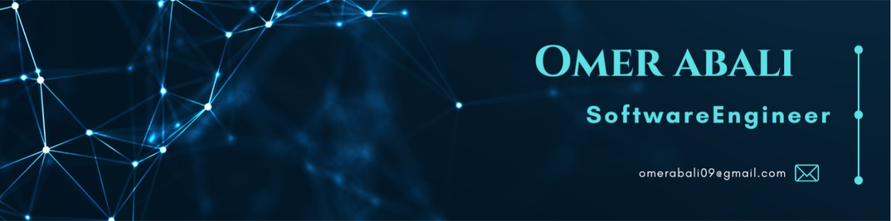

  

  <h1>Hi 👋, I'm Ömer ABALI</h1>
  
  

  
<i>Kırklareli University | Software Engineering Student</i>

---

### 👨‍💻 Hakkımda

* 🔭 **Güncel Proje:** Kapsamlı bir **Hotel Reservation System** üzerinde çalışıyorum.
* 🌱 **Öğrenim:** **Machine Learning** ve İleri Seviye Yapay Zeka modellerine odaklanıyorum.
* 💬 **Uzmanlık:** **Python, Java, C#** ve Backend mimarileri hakkında soru sorabilirsiniz.
* 📫 **İletişim:** [omerabali09@gmail.com](mailto:omerabali09@gmail.com)

---

### 🛠️ Teknolojiler ve Araçlar

| Alan | Araçlar |
| :--- | :--- |
| **Diller** |           |
| **Veritabanı** |    |
| **Geliştirme** |   |

  
  
  
   
  
  

 

### 🤝 Sosyal Medya

  
  &nbsp;&nbsp;
  

 

  

