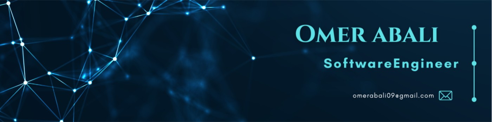

  

  <h1>Hi 👋, I'm Ömer ABALI</h1>

  

  
<i>Kırklareli University · Software Engineering (4th Year) · GPA 3.62 / 4.00</i>

  

    <a href="https://me-coral-iota.vercel.app" target="_blank"><strong>🌐 Live Portfolio</strong></a>
    ·
    <a href="https://github.com/omerabali/Me" target="_blank">Me Repo</a>
    ·
    <a href="mailto:omerabali09@gmail.com">omerabali09@gmail.com</a>
  

---

### 👨‍💻 Hakkımda

* 🎯 **Hedef:** **AI Engineer** — model, arayüz ve altyapıyı tek sistem olarak kurmak.
* 🔭 **Odak:** Ölçeklenebilir SaaS, **LLM / RAG** pipeline'ları, Flutter mobil ve React + FastAPI full-stack ürünler.
* 💼 **Staj:** Yukatek Bilişim — Beacon RAG (pgvector, Redis/BullMQ, OpenAI embeddings).
* 🌱 **Stack:** Python, TypeScript, React, Flutter/Dart, FastAPI, PostgreSQL, Docker.
* 📫 **İletişim:** [omerabali09@gmail.com](mailto:omerabali09@gmail.com) · [LinkedIn](https://www.linkedin.com/in/omerabali)

---

### ✨ Öne Çıkan Projeler

| Proje | Ne yapıyor? |
| :--- | :--- |
| [**Me**](https://github.com/omerabali/Me) | Editoryal kişisel portfolyo — React 19, Vite, TypeScript, Tailwind, FastAPI, Neon PostgreSQL, TR/EN/DE i18n · [Canlı](https://me-coral-iota.vercel.app) |
| [**Skill-Identity-Engine**](https://github.com/omerabali/Skill-Identity-Engine) | AI kariyer radarı — CV & GitHub analizi, yetenek açığı tespiti, kişiselleştirilmiş yol haritası |
| [**AI-Medium-Design**](https://github.com/omerabali/Ai-Medium-Design) | Gemini destekli otonom teknik içerik / yayın otomasyonu |
| [**STAJ22001**](https://github.com/omerabali/STAJ22001) | Yukatek staj dosyası — ThreadLab + Beacon RAG mimarisi |
| [**Farm-Ai**](https://github.com/omerabali/Farm-Ai) | Flutter ile AI destekli tarım / karar destek mobil uygulaması |
| [**Chatter-Stream**](https://github.com/omerabali/Chatter-Stream) | WebSocket tabanlı gerçek zamanlı mesajlaşma |

---

### 🛠️ Teknolojiler ve Araçlar

| Alan | Araçlar |
| :--- | :--- |
| **Diller** |        |
| **AI / ML** |    |
| **Frontend** |     |
| **Backend & DB** |       |
| **DevOps** |      |

---

  
  
   
  

 

### 🤝 Sosyal Medya

  
  
  
  

 

  

